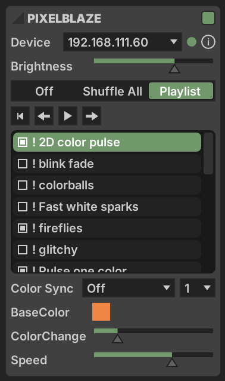
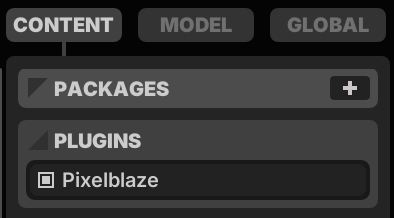
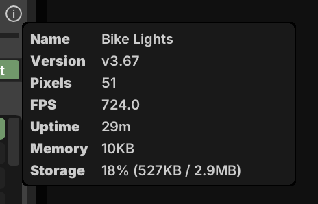
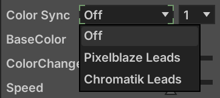

# Pixelblaze-Chromatik Plugin

A [Chromatik](https://chromatik.co) plugin for discovering and connecting to [Pixelblaze](https://electromage.com/pixelblaze) LED controllers.



## Credits

Thanks to [Ben Hencke](https://github.com/simap) for development and ongoing maintenance of the Pixelblaze platform and [WebSocket API](https://electromage.com/docs/websockets-api).

This plugin benefitted extensively from [ZRanger1](https://github.com/zranger1)'s work on [pixelblaze-client](https://github.com/zranger1/pixelblaze-client) and [SoundServerFX](https://github.com/zranger1/SoundServerFX).

## Features

- Auto-discovery of Pixelblazes on the local network
- Connection to one Pixelblaze at a time
- Pattern selection
- Sequencer controls and playlist inclusion
- User controls (sliders, color pickers, etc.)
- Information pop-up (version, memory usage, etc.)
- Bidirectional color sync with Chromatik's global palette
- Sends Pixelblaze Sensor Board packets containing Chromatik's FFT and user-mappable sensor parameters

## Requirements

- Chromatik (LX 1.2.0 or later)
- Java 21
- One or more Pixelblaze devices reachable on the local network

## Installation

1. Download or build `pb-<version>.jar` (see below).

2. Install the plugin, either:

   A. Move it to your `~/Chromatik/Packages/` directory, then restart Chromatik, *or:*

   B. Drag and drop it onto your running Chromatik window 

3. Under `Left Pane > Content > Plugins`, check the box next to **Pixelblaze**.

   

4. Restart Chromatik.

5. **PIXELBLAZE** section will be visible in `Left Pane > Global` above the COLOR PALETTE.

## Building from source

```sh
mvn clean package
```

The built JAR lands in `target/`. To build and auto-copy it to `~/Chromatik/Packages/`:

```sh
mvn clean install -Pinstall
```

## Usage

1. Open the **Pixelblaze** section in `Left Pane > Global`.
2. Enable the component in the upper right corner.
3. Devices appear in the dropdown as they're found. The first device will be automatically connected.
4. Per-device controls (patterns, sequencer, user controls) populate once the connection is established.
5. Click the information icon next to a selected device to view status and details.



### Color Sync



1. Choose a color-sync mode to link Chromatik's global palette with the Pixelblaze.  The options are:
    - `Off`: No color synchronization.
    - `Chromatik Leads`: Color from the selected index of Chromatik's global palette will be sent to the first color control (HSV or RGB) on the current Pixelblaze pattern. Send rate is limited to 10Hz to avoid overwhelming the Pixelblaze during continuous color modulation.
    - `Pixelblaze Leads`: The color from the Pixelblaze's first color control on the current pattern will be sent to the selected index of Chromatik's global palette.
2. Select an index for Chromatik's global color palette, which will be the source in `Chromatik Leads` or the target in `Pixelblaze Leads`.

## License

Copyright 2026 Justin K. Belcher. Released under the Apache License 2.0 with the [Commons Clause](https://commonsclause.com/) — see [LICENSE](LICENSE).

You're free to use, modify, and redistribute this plugin alongside any licensed Chromatik instance (commercial or not). You may not sell the plugin, whether standalone or as part of a paid bundle.
